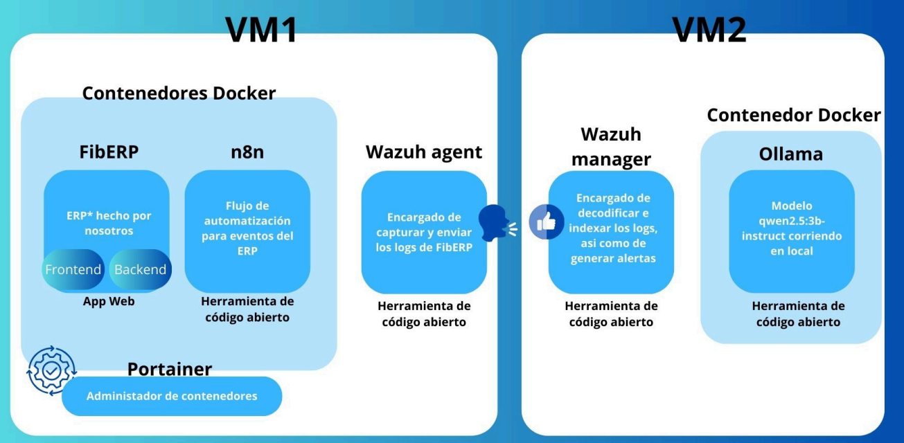
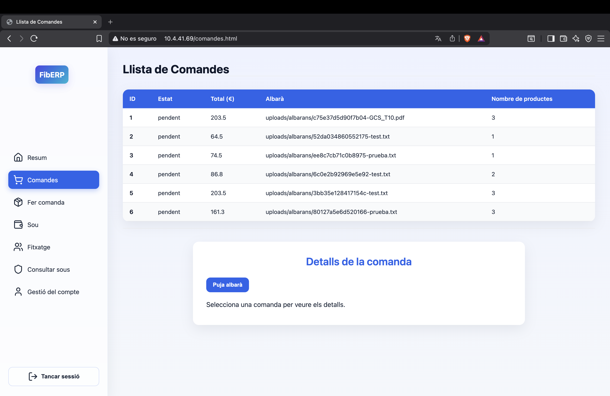

# ERP System with Integrated Intrusion Detection (IDS)

> Full-stack ERP application extended with a real-time Intrusion Detection System (IDS) and automated security analysis pipeline.

---

## My Contributions

In this project, I focused on the **automation and security orchestration layer**, specifically:

- Designed and implemented **automation workflows in n8n** to process and respond to security alerts  
- Integrated **Wazuh alerts with n8n**, enabling automated handling and enrichment of security events  
- Built workflows connecting **Wazuh, VirusTotal API, and LLM (Ollama)** for intelligent log analysis  
- Contributed to **system integration and debugging across services** (Docker, backend, IDS components)  
- Assisted in configuring and validating **log pipelines and alert generation**

---

## Description

This project was developed as part of the *Projecte de Tecnologia de la Informació (PTI)* course at FIB (UPC).

The goal is to build a **web-based ERP system** enhanced with an **Intrusion Detection System (IDS)** to monitor and protect application activity.

The ERP acts as a controlled **log generator**, using real user interactions as input for security monitoring and analysis.

---

## Key Features

- Real-time **log monitoring and intrusion detection** using Wazuh  
- Automated **security workflows and alert orchestration** with n8n  
- Integration with **VirusTotal API** for threat intelligence enrichment  
- **LLM-based alert summarization** using Ollama (Qwen 2.5)  
- Distributed architecture across **two virtual machines**  
- Secure backend with **REST API and JWT authentication**

---

## System Impact

- Processes and analyzes **large volumes of application-generated logs**  
- Reduces manual effort through **automated alert triaging and enrichment**  
- Enables **near real-time detection of suspicious activity**  
- Demonstrates integration of **IDS + automation + AI-based analysis**

---

## Architecture

The system is deployed across **two virtual machines (VMs)** to optimize performance and isolate workloads.

### VM1 – Application & Automation Layer

- **Frontend:** HTML, CSS, JavaScript  
- **Backend:** Symfony 7 (business logic + log generation)  
- **n8n:** automation and orchestration of security workflows  
- **Wazuh Agent:** collects and forwards logs  

### VM2 – Security & Analysis Layer

- **Wazuh Manager & Dashboard:** log processing, indexing, and alert generation  
- **LLM (Ollama):** intelligent analysis and summarization of alerts  

---

## Technical Challenges

### High Volume of Security Alerts
Wazuh generates a large number of alerts, many of which are noisy.  
→ Addressed by designing **n8n workflows to filter, prioritize, and enrich alerts**

### Multi-System Integration
Coordinating communication between Wazuh, n8n, external APIs, and LLM required careful orchestration.  
→ Implemented **event-driven workflows using webhooks and automation pipelines**

### Resource Constraints (LLM)
Running a local LLM requires significant memory and compute resources.  
→ Solved by **separating the system into two VMs**

### Lack of Context in Raw Logs
Raw logs are difficult to interpret and act upon.  
→ Enhanced alerts using **VirusTotal + LLM summarization**

---

## ERP Application

Main interface where user activity generates logs for security monitoring.

### Features

- User authentication and management  
- Product and order management  
- Time tracking  
- Payroll consultation  
- Admin panel  

---

## Backend (REST API)

Handles business logic and security log generation.

### Features

- Secure endpoints using **JWT authentication**  
- Generation of `security.log` and `generic.log`  
- Validation of sensitive actions (login, file upload, password changes)  

---

## n8n – Automation Workflows

Core component for **security orchestration and automation**.

### Features

- Processes alerts received from Wazuh  
- Enriches alerts using VirusTotal  
- Sends data to LLM for summarization  
- Automates responses and notifications  

---

## Wazuh Dashboard

Centralized security monitoring interface.

### Features

- Visualization of alerts and events  
- Log indexing and analysis  
- System and agent status monitoring  

---

## Container Management (Portainer)

Used for managing Docker containers and services.

---

## Tech Stack

- **Backend:** Symfony 7 (PHP)  
- **Frontend:** HTML, CSS, JavaScript  
- **Security:** Wazuh (IDS)  
- **Automation:** n8n  
- **AI:** Ollama (Qwen 2.5)  
- **Containerization:** Docker  
- **External APIs:** VirusTotal  

---

## How to Run

1. Clone the repository  
2. Configure environment variables  
3. Run services using Docker Compose  
4. Access the main services locally  

*(Configuration may vary depending on environment setup)*

---

## Notes

This project was developed in an academic context and extended with additional features focused on **security automation, system integration, and real-time analysis**.
